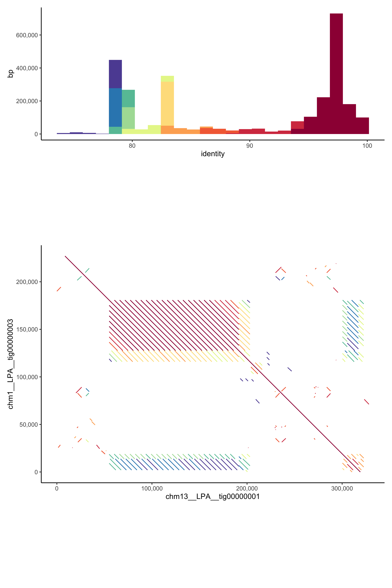

# aln_plot

## regular aln_plot 
See the template in `cmds.sh` which takes three arguments `{target_seq}` `{query_seq}` and `{output_paf}`. 
Then take the output table named `{output_paf}.tbl` and edit the R script `aln_plot.R` to use it as input.
Note your target will be the x axis and the query will be the y.  

## cen aln_plot
See the tempalte in `cen_cmds.sh`. 
This takes the same arguments as above however the query sequnce is split by the script into samller (5kbp) fragemtns to speed up alignment. 

## TODO
make snakemake
alter R script to take inputs and outputs

